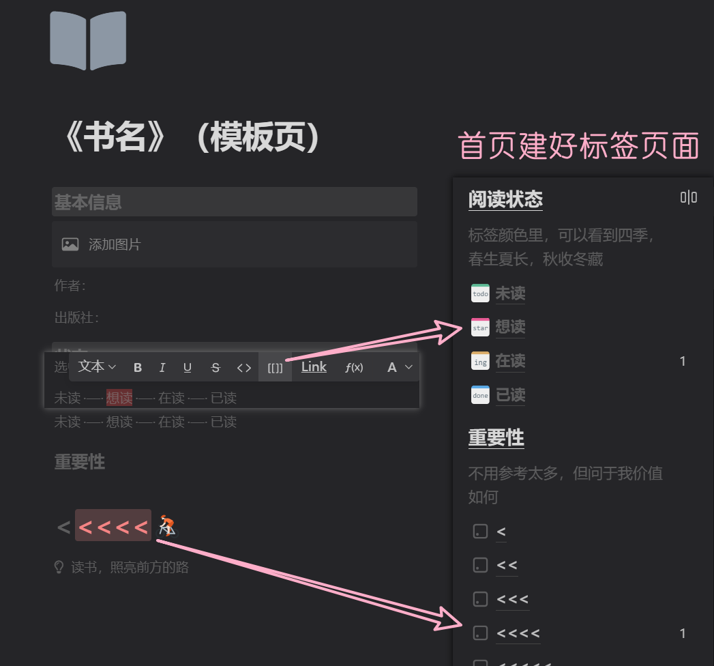

# 我的书库

$$
读书，可以很简单
$$

- * 通过在模板页引用的方法，快速标记阅读状态和重要性（评分）
具体方法：
点击 * ** 添加一本书** * 后进入新书页面，选中“想读”，点击工具栏 * **[[]]** * 图标，也可以选中后直接按快捷键：* `ctrl/cmd` + `shift` + `R`*；然后选中下方重要性里的“<<<”进行同样操作，这样你就标记此书为重要度3级的想读书籍* 

添加一本书

&ensp;&ensp;&ensp;&ensp;[《书名》（模板页）](%E3%80%8A%E4%B9%A6%E5%90%8D%E3%80%8B%EF%BC%88%E6%A8%A1%E6%9D%BF%E9%A1%B5%EF%BC%89/%E3%80%8A%E4%B9%A6%E5%90%8D%E3%80%8B%EF%BC%88%E6%A8%A1%E6%9D%BF%E9%A1%B5%EF%BC%89.md)

[《时间简史》](%E3%80%8A%E6%97%B6%E9%97%B4%E7%AE%80%E5%8F%B2%E3%80%8B/%E3%80%8A%E6%97%B6%E9%97%B4%E7%AE%80%E5%8F%B2%E3%80%8B.md)

### 阅读状态

*标签颜色里，可以看到四季，春生夏长，秋收冬藏* 

[想读](%E6%83%B3%E8%AF%BB/%E6%83%B3%E8%AF%BB.md)

[未读](%E6%9C%AA%E8%AF%BB/%E6%9C%AA%E8%AF%BB.md)

[在读](%E5%9C%A8%E8%AF%BB/%E5%9C%A8%E8%AF%BB.md)

[已读](%E5%B7%B2%E8%AF%BB/%E5%B7%B2%E8%AF%BB.md)

### 重要性

*不用参考太多，但问于我价值如何* 

[<](%3C/%3C.md)

[<<](%3C%3C/%3C%3C.md)

[<<<](%3C%3C%3C/%3C%3C%3C.md)

[<<<<](%3C%3C%3C%3C/%3C%3C%3C%3C.md)

[<<<<<](%3C%3C%3C%3C%3C/%3C%3C%3C%3C%3C.md)

